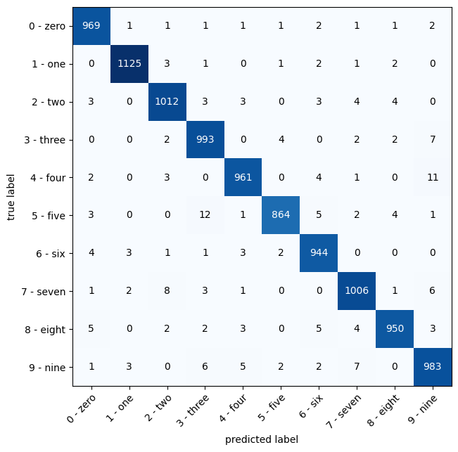
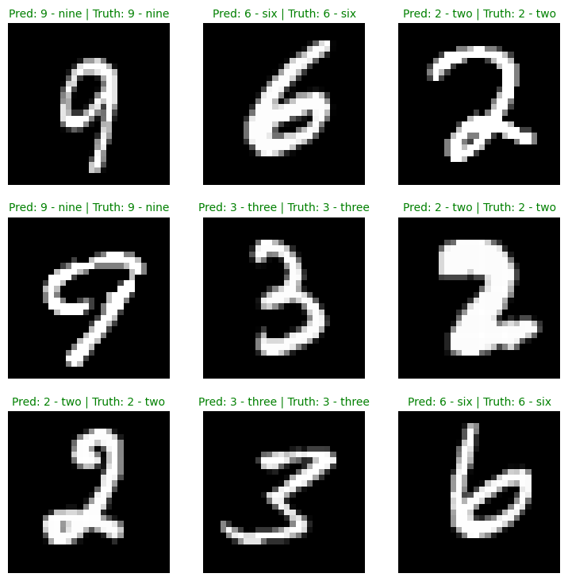
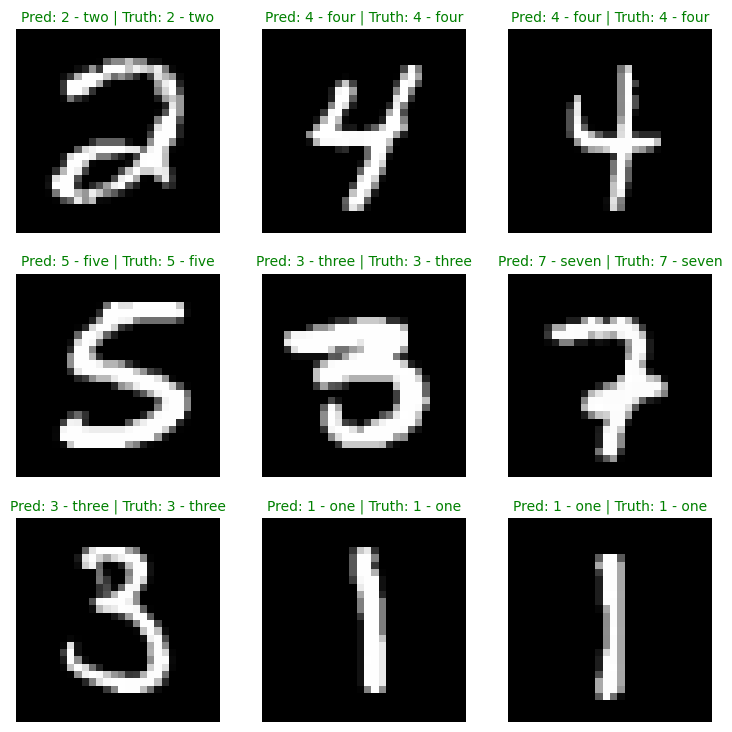

# DIGITAL RECOGNITION USING ML

## Objective:

Develop a Jupyter notebook that uses a machine learning model to identify and classify
handwritten digits.

## Implementation:

The following tasks were implemented in the notebook `01_MNIST.ipynb`:
1. Import Libraries
2. Data Loading & PreProcessing
3. Model Selection (3 models were implemented but only 2 were trained)
4. Training (based on overall accuracy)
5. Evaluation (confusion matrix and classification report)
6. Inference (visualization in test random samples)

## Approach & Observations:

* Based on the MNIST dataset and the objective, the task is a **multiclass classification**.
* Since the dataset are images, the main approaches regarding architectures could be a convolutional neural network(CNN) or a Vision Transformers network(ViT).
* The images in MNIST are small(28x28) and grayscale, so a custom MLP and CNN model are enough.
* Custom MLP model, its layers go from 728,128,10 with a ~100k trainable parameters
* Custom CNN model, its layers are 2 classic layers(conv-relu-conv-relu-maxpool) with ~8k trainable parameters.
* Between these 2 last models, CNNs are better since takes advantage with spatial information around each pixel (convolution operation)
* For the MNIST dataset, both models have similar overall accuracy 98% over 5 epochs.
* Pre-trained model was not trained with MNIST since outcomes from the other models were acceptable.
* Most miss classification in test data were in 3 and 9 classes.

## Results:

1. Custom MLP model:

    * Confusion Matrix

        

    * Inference Plot

        

2. Custom CNN model:

    * Confusion Matrix

        

    * Inference Plot

        

## Notes & Improvements:
* Modern training techniques can be used in complex scenarios like scheduler learning rate, gradient accummulation, etc.
* For multiple experiements, monitoring libraries are useful like tensorboard, W&B, etc
* Pretrained models could be used like EfficientNet or ViT